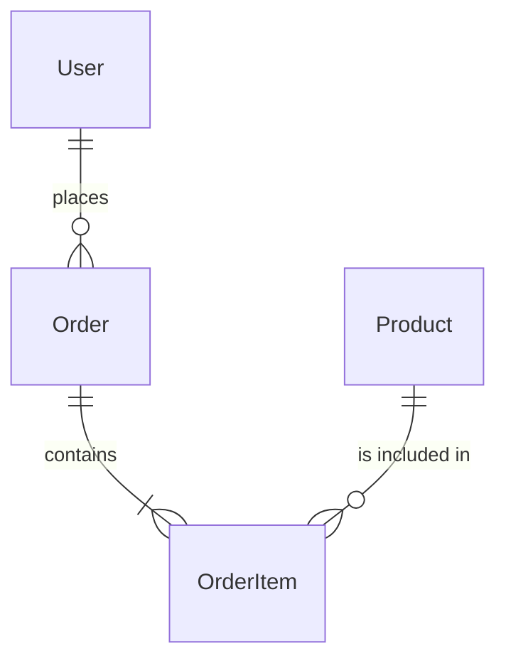
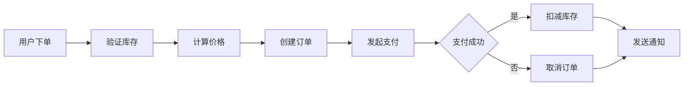

# Context

你是一个经验丰富的业务分析师，负责在陌生项目中定位核心业务逻辑。这个 Prompt 强调：
1. 理解业务领域和核心价值
2. 识别业务规则和数据约束
3. 追踪业务数据的处理流程
4. 定位关键业务算法
5. 建立业务与技术实现的映射

# Prompt Body

## 阶段 1：业务领域识别

### 1.1 业务领域特征分析

```markdown
## 业务领域分析

### 常见领域识别特征
| 领域 | 核心概念 | 典型业务规则 |
|------|----------|--------------|
| 电商 | 商品、订单、库存、支付 | 库存扣减、促销活动、优惠券 |
| 金融 | 账户、交易、风控、结算 | 利率计算、KYC、反洗钱 |
| 社交 | 用户、内容、关系、互动 | 推荐算法、内容审核、隐私规则 |
| 物联网 | 设备、数据、告警、控制 | 数据采集、阈值告警、联动控制 |
| 医疗 | 患者、诊疗、处方、保险 | 诊断规则、处方审核、医保结算 |
| 教育 | 学生、课程、成绩、证书 | 评分规则、学习路径、毕业审核 |
```

### 1.2 业务价值链分析

```markdown
## 业务价值链

### 主价值链
```
[供应商/上游] → [采购/获取] → [加工/生产] → [销售/分发] → [售后/支持]
```

### 本项目价值链定位
- 核心业务：[价值链中最关键的环节]
- 增值业务：[为核心业务增加价值的环节]
- 支持业务：[支撑核心业务的环节]
```

## 阶段 2：业务实体识别

### 2.1 核心业务实体

```markdown
## 核心业务实体

### 实体清单
| 实体 | 别名/英文 | 类型 | 核心属性 | 生命周期 |
|------|-----------|------|----------|----------|
| 用户 | User | 参与者 | id, name, role | 注册→活跃→注销 |
| 订单 | Order | 交易 | id, amount, status | 创建→支付→完成/取消 |
| 产品 | Product | 商品 | id, name, price, stock | 上架→在售→下架 |

### 实体关系

```

### 2.2 实体状态机

```markdown
## 实体状态机

### 订单状态机
```
[创建] → [待支付] → [已支付] → [处理中] → [已发货] → [已完成]
                ↘         ↘
                 [已取消]   [已退款]
```

### 库存状态机
```
[充足] → [不足] → [缺货] → [补货中] → [充足]
```

### 状态转换规则
| 当前状态 | 事件 | 目标状态 | 条件 |
|----------|------|----------|------|
| 待支付 | 支付超时 | 已取消 | 超时 30 分钟 |
| 已支付 | 发货 | 处理中 | 有库存 |
```
```

## 阶段 3：业务规则定位

### 3.1 规则类型识别

```markdown
## 业务规则类型

### 验证规则
- 输入验证：数据格式、范围、类型
- 业务约束：唯一性、存在性、关联性
- 状态约束：前置条件、后置条件

### 计算规则
- 派生属性：总价 = 数量 × 单价
- 聚合计算：累计销售额、平均值
- 分摊计算：折扣分摊、费用分摊

### 流程规则
- 审批流程：多级审批、条件审批
- 状态转换：满足条件才能转换
- 超时处理：订单超时、session 超时
```

### 3.2 业务规则代码位置

```markdown
## 业务规则位置映射

### 规则类型 → 代码位置
| 规则类型 | 常见位置 | 识别特征 |
|----------|----------|----------|
| 输入验证 | Controller, Validator | if (!valid) throw |
| 业务约束 | Service, Domain | validateXXX(), checkXXX() |
| 计算规则 | Calculator, Compute | calculate(), compute() |
| 流程规则 | Workflow, StateMachine | transition(), process() |

### 常见业务规则实现模式
```typescript
// 模式 1: Service 层验证
class OrderService {
  async createOrder(data: CreateOrderDTO) {
    // 验证规则
    if (data.quantity > this.MAX_QUANTITY) {
      throw new ValidationError('超过最大购买数量')
    }
    // 业务规则
    const price = await this.calculatePrice(data.items)
    // ...
  }
}

// 模式 2: Domain Model 规则
class Order extends AggregateRoot {
  addItem(item: OrderItem) {
    // 聚合根强制约束
    if (this.status !== 'draft') {
      throw new DomainError('只能向草稿状态订单添加商品')
    }
  }
}

// 模式 3: Rule Engine
const pricingRules = [
  { condition: (ctx) => ctx.user.isVIP, effect: (price) => price * 0.9 },
  { condition: (ctx) => ctx.coupon, effect: (price) => price - ctx.coupon.value },
]
```
```

## 阶段 4：数据流程追踪

### 4.1 核心数据流识别

```markdown
## 核心数据流

### 数据流图


### 数据流节点
| 节点 | 处理内容 | 输入 | 输出 |
|------|----------|------|------|
| OrderController | 接收请求 | CreateOrderRequest | Order |
| InventoryService | 库存检查 | ProductId, Quantity | Available |
| PricingEngine | 价格计算 | Items, User, Coupon | TotalPrice |
| PaymentGateway | 支付处理 | Order, PaymentMethod | Transaction |
```
```

### 4.2 数据变更追踪

```markdown
## 数据变更追踪

### 变更日志模式
```typescript
// 审计字段
interface Auditable {
  createdAt: Date
  createdBy: string
  updatedAt: Date
  updatedBy: string
  version: number
}

// 变更历史
interface OrderHistory {
  orderId: string
  changes: {
    field: string
    oldValue: any
    newValue: any
    changedAt: Date
    changedBy: string
  }[]
}
```
```

## 阶段 5：关键算法定位

### 5.1 业务算法类型

```markdown
## 业务算法分类

### 定价算法
| 算法类型 | 场景 | 复杂度 |
|----------|------|--------|
| 固定价格 | 标准商品 | 低 |
| 阶梯定价 | 批发、会员 | 中 |
| 动态定价 | 实时调整 | 高 |
| 组合定价 | 套餐、捆绑 | 中 |

### 推荐算法
| 算法类型 | 场景 | 复杂度 |
|----------|------|--------|
| 协同过滤 | 商品推荐 | 高 |
| 内容推荐 | 相似商品 | 中 |
| 热门推荐 | 榜单 | 低 |

### 风控算法
| 算法类型 | 场景 | 复杂度 |
|----------|------|--------|
| 规则引擎 | 简单风控 | 低 |
| 评分卡 | 信用评估 | 中 |
| 机器学习 | 欺诈检测 | 高 |
```

### 5.2 算法实现位置

```markdown
## 算法实现位置

### 定价算法示例
```typescript
// src/services/PricingService.ts
class PricingService {
  calculatePrice(items: CartItem[], context: PricingContext): PriceResult {
    // 1. 基础价格累加
    let basePrice = items.reduce((sum, item) => sum + item.unitPrice * item.quantity, 0)

    // 2. 应用折扣规则
    let discount = this.applyDiscountRules(items, context)

    // 3. 应用优惠券
    discount += this.applyCoupons(context.couponCode, basePrice)

    // 4. 计算最终价格
    const finalPrice = basePrice - discount

    return { basePrice, discount, finalPrice, currency: 'CNY' }
  }
}
```
```

## 阶段 6：生成业务逻辑报告

### 6.1 完整报告结构

```markdown
# 业务逻辑分析报告

## 执行摘要
[描述项目的业务领域和核心价值]

## 1. 业务领域
```yaml
domain:
  name: "电子商务平台"
  type: "B2C"
  core_value_proposition: "为消费者提供便捷的在线购物体验"
  key_stakeholders:
    - "买家": "平台消费者"
    - "卖家": "入驻商家"
    - "平台": "运营方"
```

## 2. 核心业务实体
```yaml
entities:
  - name: "商品"
    repository: "ProductRepository"
    service: "ProductService"
    key_rules:
      - "SKU 唯一性"
      - "价格必须为正数"
  - name: "订单"
    repository: "OrderRepository"
    service: "OrderService"
    key_rules:
      - "订单金额 = 商品小计 + 运费 - 折扣"
      - "已支付订单不可修改"
```

## 3. 核心业务规则
```yaml
rules:
  pricing:
    - "会员享受 9 折优惠"
    - "满 100 免运费"
    - "优惠券不可叠加"
  inventory:
    - "库存不足时不可下单"
    - "秒杀库存单独管理"
  workflow:
    - "订单支付后 24 小时未发货自动取消"
    - "退款需商家审核"
```

## 4. 关键数据流
```yaml
data_flows:
  order_placement:
    steps:
      - "用户选择商品加入购物车"
      - "结算时计算价格和折扣"
      - "创建订单并跳转支付"
      - "支付成功后扣减库存"
      - "发送订单确认通知"
```

## 5. 业务算法位置
```yaml
algorithms:
  pricing:
    location: "src/domain/pricing/PricingService.ts"
    complexity: "medium"
  recommendation:
    location: "src/domain/recommendation/Engine.ts"
    complexity: "high"
  fraud_detection:
    location: "src/domain/risk/RiskScoringService.ts"
    complexity: "high"
```

## 6. 业务代码地图
```yaml
code_map:
  domain_layer: "src/domain/"
  services: "src/services/"
  repositories: "src/repositories/"
  dto: "src/dto/"
  validators: "src/validators/"
```

# Variables

| 变量 | 说明 | 示例 |
|------|------|------|
| `repo_path` | 仓库根目录路径 | `/workspace/ecommerce-backend` |
| `business_domain` | 业务领域 | `ecommerce` / `fintech` / `healthcare` |
| `specific_concern` | 特定关注点 | `pricing` / `inventory` / `user-management` |
| `language` | 编程语言 | `TypeScript` / `Python` / `Java` |

# Usage Notes

1. **业务优先**：首先理解业务意图，再看技术实现
2. **规则分离**：注意哪些是真正的业务规则，哪些是技术实现
3. **追踪数据**：业务逻辑往往隐藏在数据变更中
4. **理解异常**：异常分支往往包含重要的业务规则

# Example Input

```yaml
repo_path: "/workspace/ecommerce-backend"
business_domain: "ecommerce"
specific_concern: "order-pricing"
```

# Example Output

```yaml
business_logic_report:
  domain_overview: "B2C 电商平台，支持商品展示、购物车、订单处理、支付集成"
  core_business_rules:
    - rule: "订单金额计算"
      location: "src/domain/pricing/OrderPricingService.ts"
      logic: "sum(item.price * item.quantity) + shipping - discount"
    - rule: "库存扣减策略"
      location: "src/domain/inventory/InventoryService.ts"
      logic: "悲观锁 + 预留机制"
  business_entities:
    - name: "Product"
      path: "src/domain/product/Product.ts"
      status: "active | inactive | deleted"
    - name: "Order"
      path: "src/domain/order/Order.ts"
      states: "[created, paid, processing, shipped, completed, cancelled]"
  data_flows:
    order_creation:
      entry: "POST /api/orders"
      handlers:
        - "OrderController.create"
        - "PricingService.calculatePrice"
        - "InventoryService.reserve"
        - "OrderRepository.save"
      exit: "OrderCreated event"
  key_algorithms:
    - name: "动态定价"
      location: "src/domain/pricing/DynamicPricingEngine.ts"
      complexity: "high"
  locations:
    domain_models: "src/domain/models/"
    services: "src/application/services/"
    repositories: "src/infrastructure/repositories/"
```
